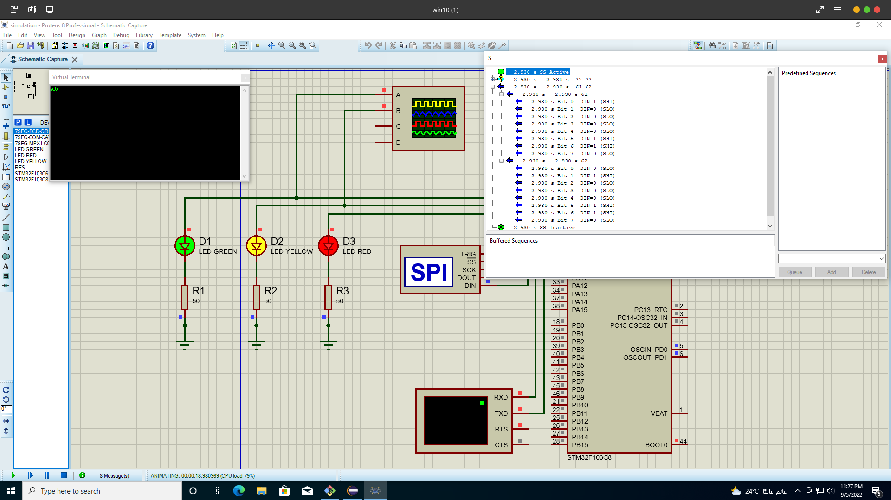

# Final-Project-DMA-SPI-UART

---

In this project, 1 MCU receives data through UART and then sends it through SPI Using DMA for both processes.

UART communication with DMA is done through channel number 5

and SPI communication with DMA is done through channel number 3

The application takes a parameter `Copy_u32NumberOfDataElements` which determinants the number of bytes in the communication.

- UART data is sent to the controller using virtual terminal
- SPI data is monitored through SPI debugger
- LED D1 toggles as an indication of program running
- LED D2 is turned on when UART-DMA data reception is complete
- LED D3 is turned on When data SPI-DMA transmission is complete

...

---
